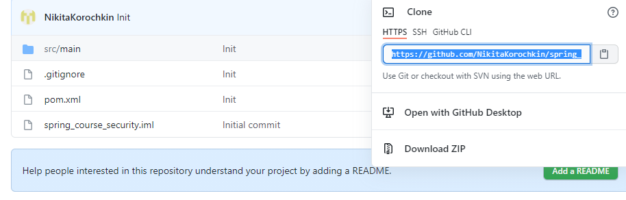
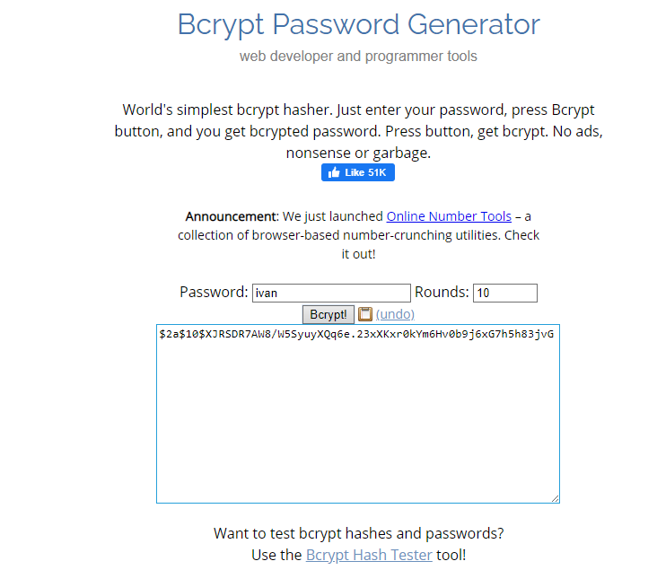
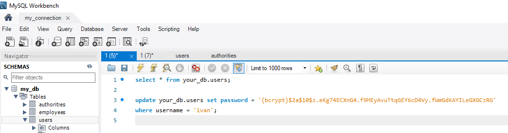
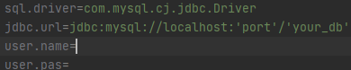
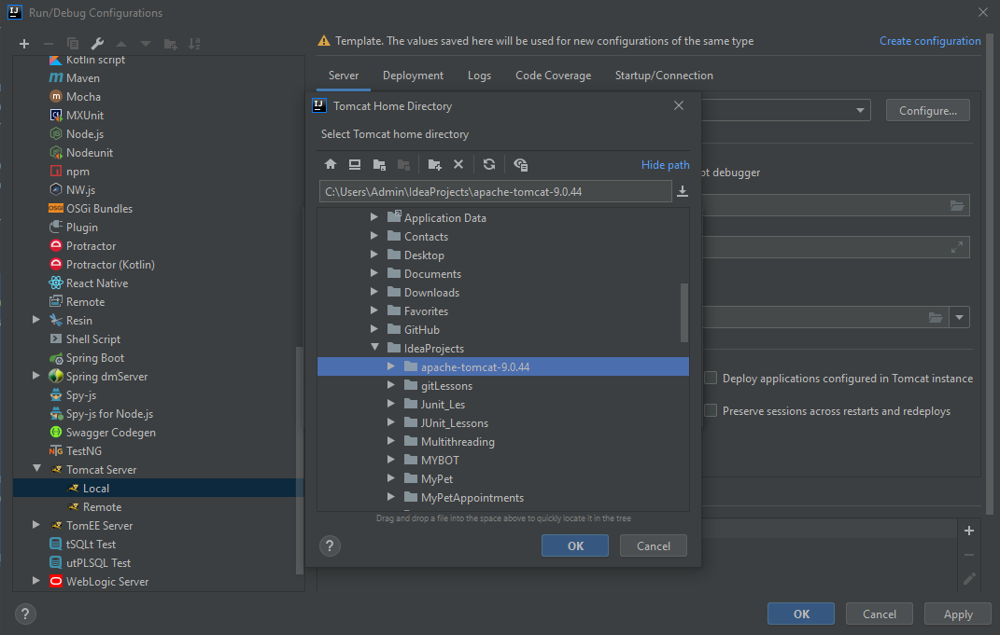
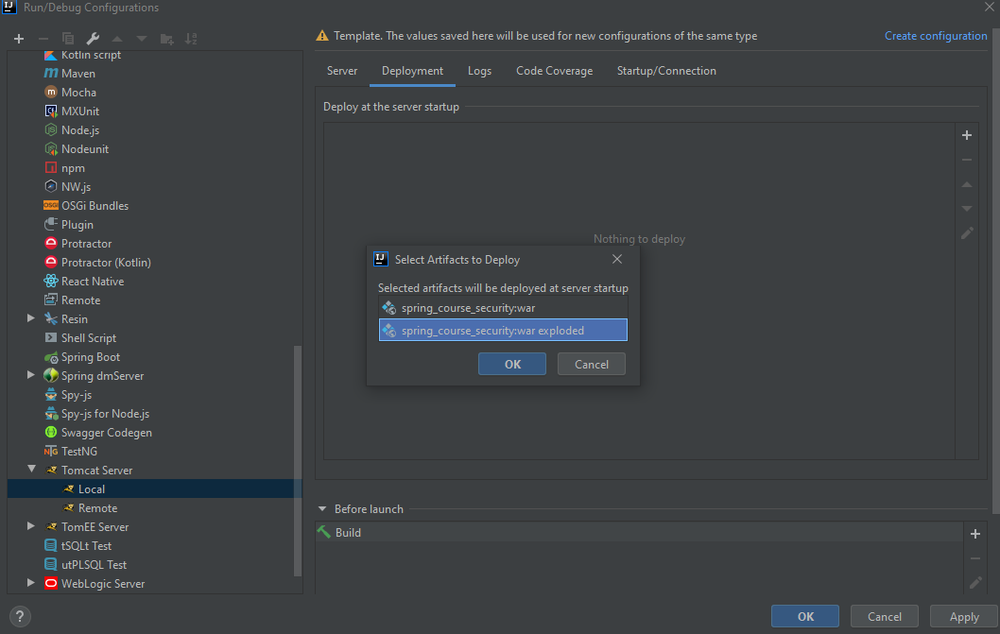
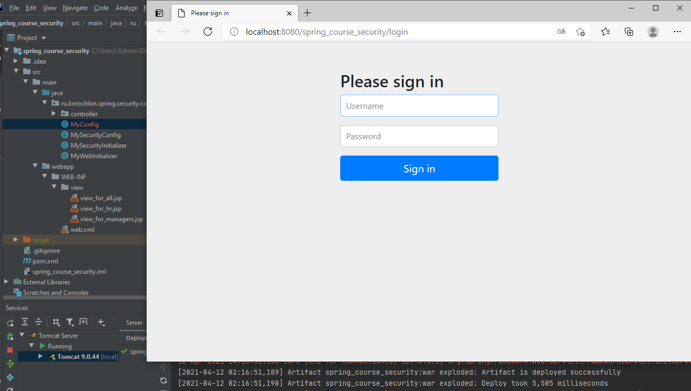

# spring_security

## Описание
Простое Spring Security приложение, в котором реализованы следующие возможности:
- процедура аутентификации
- процедура авторизации
- хранение пароля в БД в зашифрованном и не шифрованном видах
---
## Технологии
Spring(MVC, Security), MySQL, Tomcat 9(9.0.44), Maven

---
## Запуск
Для запуска приложения необходимо совершить следующие действия:

1. Клонировать репозиторий с проектом к себе на компьютер:
    
    
    В командной строке проходим до нужной директории, куда и будет клонирован репозиторий 
    `$ cd YOUR_DIRECTORY`, далее прописываем команду `$ git clone URL`. Репозиторий клонирован.

2. Открыть Intellij Idea: File -> Open -> ... -> spring_security


3. Подготовить таблицы в БД
Создадим две таблицы users и authorities и заполним их данными:
```sql
USE your_db;

CREATE TABLE users (
  username varchar(15),
  password varchar(100),
  enabled tinyint(1),
  PRIMARY KEY (username)
) ;

CREATE TABLE authorities (
  username varchar(15),
  authority varchar(25),
  FOREIGN KEY (username) references users(username)
) ;

INSERT INTO my_db.users (username, password, enabled)
VALUES
	('Nikita', '{noop}nikita', 1),
	('Svetlana', '{noop}svetlana', 1),
	('Ivan', '{noop}ivan', 1);
    
INSERT INTO my_db.authorities (username, authority)
VALUES
	('Nikita', 'ROLE_EMPLOYEE'),
	('Elena', 'ROLE_HR'),
    ('Ivan', 'ROLE_HR'),
	('Ivan', 'ROLE_MANAGER');
```
Для хранения пароля в зашифрованном виде, я использовал bcrypt шифрование.
Пример:
Зашифруем пароль для user'a Ivan. Для этого я использовал Bcrypt Password Generator https://www.browserling.com/tools/bcrypt



Полученный пароль нужно внести в таблицу и обязательно указать `{bcrypt}`


 
4. Заполнить файл `config.properties` актуальными данными. 
   
В `sql.driver` я оставил драйвер, кототрый использовал в конкретном проекте

В поле `jdbc.url` подставляем название вашей БД и порт, в `user.name` - ваш username, в `user.pas` - ваш пароль.



5. Настроить Appache Tomcat

Я использовал Tomcat 9.0.44

В Intellij Idea нажимаем на Edit Configuration рядом с кнопкой запуска, выбираем Tomcat Server -> Local, в появившемся окне нажимаем Configure и находим архив tomcat (скачиваем при необходимости)



Переходим в Deployment, добавляем артефакт 



Нажимаем Apply, OK. Сервер готов.


*Теперь мы можем запустить наше приложение на локальном сервере. 
После успешного запуска вы увидите следующую страницу в браузере и сообщение в консоли*


